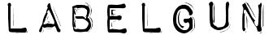

 
Labelgun is a mapping library agnostic labelling engine. It allows you to avoid cluttering in mapping popups and labels, providing precedence to labels of your choice.

The library makes three assumptions:

* Each label has a bounding rectangle (Min X, Min Y, Max X, Max Y)
* Each label has a weight
* You can provide a function that will hide and show a label (e.g. through CSS class or JavaScript function)

### Install
You can install all the necessary dependencies with npm

`npm install`

### Develop

Labelgun is transpiled from ES6 using babel presets for Webpack 2. You can build the source using

`webpack`

or

`webpack --env.minified`

For the minified version.

### Test

Labelgun uses Jasmine for testing. You can do an npm install and then use:

`jasmine`

at the command line. Tests are found in the `spec` folder  

### Demo

A nice interactive way to play with the demos is to use a hot reloading web server such as live-server:

`npm install -g live-server`

`live-server`

### npm

Labelgun is hosted on npm. You can install via:

`npm install labelgun --save`

## Acknowledgements
Labelgun as an open source project was made possible thanks to [Podaris](http://www.podaris.com).

## License
MIT
